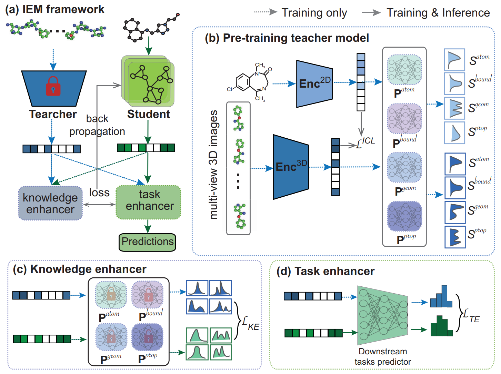

# IEM

### Official PyTorch-based implementation of Paper "An Image-enhanced Molecular Graph Representation Learning Framework", IJCAI 2024.

### [[Paper](https://www.ijcai.org/proceedings/2024/675)] [[Appendix](https://github.com/HongxinXiang/IEM/blob/main/assets/appendix.pdf)] [[Poster](#)] [[PPT](#)]





## News!

**[2024/04/17]** Accepted in IJCAI 2024 !!!

**[2024/01/17]** Repository installation completed.


## TODO

- [x] Publish pre-training dataset
- [x] Publish supplementary material of IEM
- [x] Publish downstream task data
- [x] Release pre-trained teacher model


## Environments

#### 1. GPU environment

CUDA 11.6

Ubuntu 18.04


#### 2. create conda environment

```bash
# create conda env
conda create -n IEM python=3.9
conda activate IEM

# install environment
pip install rdkit
pip install torch==1.13.1+cu116 torchvision==0.14.1+cu116 torchaudio==0.13.1 --extra-index-url https://download.pytorch.org/whl/cu116 -i https://pypi.tuna.tsinghua.edu.cn/simple

pip install timm==0.6.12
pip install tensorboard
pip install scikit-learn
pip install setuptools==59.5.0
pip install pandas
pip install torch-cluster torch-scatter torch-sparse torch-spline-conv -f https://pytorch-geometric.com/whl/torch-1.13.1%2Bcu116.html
pip install torch-geometric==1.6.0
pip install dgl-cu116
pip install ogb
```


## Pre-Training Teacher Model

#### 1. Pre-training Dataset

The pre-trained datasets (2 million) can be accessed in following table

| Name                  | Download link                                                | Description                                                  |
| --------------------- | ------------------------------------------------------------ | ------------------------------------------------------------ |
| iem-200w.csv          | [OneDrive](https://1drv.ms/u/s!Atau0ecyBQNTgRH30gPFlqS5CO5v?e=Qj69TB) | index and SMILES information for all molecules               |
| image2d.tar.gz        | [OneDrive](https://1drv.ms/u/s!Atau0ecyBQNTgRO5s89pR6-VdZA5?e=efzst6) | 2D images (RGB format)                                       |
| image3d.tar.gz        | [BaiduCloud](https://pan.baidu.com/s/1C8l3_tjd8dFS5oGvXqHcxQ?pwd=pdq4) | multi-view 3D images (RGB format)                            |
| mol-basic-info.tar.gz | [OneDrive](https://1drv.ms/u/s!Atau0ecyBQNTgRTFRkDDCUuAErnc?e=pmY6d9) | predefined knowledge, including atom, bound, geometry, attributes |

Please download all data listed above and put it in `datasets/pre-training/iem-200w/processed/` if you want to train your own teacher model from scratch.


#### 2. ❄️Direct access to pre-trained teachers

The pre-trained teacher model can be accessed in following table.

| Name                | Download link                                                | Description                                                  |
| ------------------- | ------------------------------------------------------------ | ------------------------------------------------------------ |
| Pre-trained teacher | [IEM.pth](https://1drv.ms/u/s!Atau0ecyBQNTb0DCbVjgADxvcwo?e=580vg5) | You can download the teacher and put it in the directory: `resumes/pretrained-teachers/`. |


#### 3. 🔥Train your own teacher model from scratch

If you want to pre-train your own teacher model, see the command below.


Usage:

```python
usage: pretrain_teacher.py [-h] [--dataroot DATAROOT] [--dataset DATASET]
                           [--workers WORKERS] [--nodes NODES]
                           [--ngpus_per_node NGPUS_PER_NODE]
                           [--dist-url DIST_URL] [--node_rank NODE_RANK]
                           [--model_name MODEL_NAME]
                           [--warmup_rate WARMUP_RATE] [--lr LR]
                           [--momentum MOMENTUM] [--weight-decay WEIGHT_DECAY]
                           [--weighted_loss] [--runseed RUNSEED]
                           [--start_epoch START_EPOCH] [--epochs EPOCHS]
                           [--batch BATCH] [--imageSize IMAGESIZE]
                           [--temperature TEMPERATURE]
                           [--base_temperature BASE_TEMPERATURE]
                           [--resume RESUME] [--n_ckpt_save N_CKPT_SAVE]
                           [--log_dir LOG_DIR]
```


run command to pre-train teacher:

```python
python pretrain_teacher.py \
	--nodes 1 \
	--ngpus_per_node 1 \
	--weighted_loss \
	--epochs 300 \
	--batch 128 \
	--lr 1e-2 \
	--ngpu 1 \
	--workers 4 \
	--dataroot ../datasets/pre-training/ \
	--dataset toy \
	--log_dir ./experiments/pretrain_teacher
```


## Distillation Training on Downstream Tasks

All downstream task data is publicly accessible below:

**8 classification tasks (RGB format):**

| Datasets | #Molecules | #Task | Links                                                        |
| -------- | ---------- | ----- | ------------------------------------------------------------ |
| Tox21    | 7,831      | 12    | [[OneDrive](https://1drv.ms/u/s!Atau0ecyBQNTgQyEq7V7amXDi7yn?e=O58EfS)] |
| ToxCast  | 8,576      | 617   | [[OneDrive](https://1drv.ms/u/s!Atau0ecyBQNTgQ1QvgowlIH3Y0RP?e=t9kWcH)] |
| Sider    | 1,427      | 27    | [[OneDrive](https://1drv.ms/u/s!Atau0ecyBQNTgQuYE9N7W_CRIRPE?e=LUXCdB)] |
| ClinTox  | 1,478      | 2     | [[OneDrive](https://1drv.ms/u/s!Atau0ecyBQNTgQjeOeNgTJMhF5jz?e=0sPvnm)] |
| MUV      | 93,087     | 17    | [[OneDrive](https://1drv.ms/u/s!Atau0ecyBQNTgQ8Evh0Vg9IjLF45?e=dwTE1X)] |
| HIV      | 41,127     | 1     | [[OneDrive](https://1drv.ms/u/s!Atau0ecyBQNTgQ5Oq-42YJQ9kRm9?e=YRitpW)] |
| BBBP     | 2,039      | 1     | [[OneDrive](https://1drv.ms/u/s!Atau0ecyBQNTgQrPNjO167wjZO6J?e=2Yie82)] |
| BACE     | 1,513      | 1     | [[OneDrive](https://1drv.ms/u/s!Atau0ecyBQNTgQm-3Aqvp0HV0rX5?e=Zg6ILf)] |


**4 regression tasks (BGR format):**

| Datasets | #Molecules | #Task | Links                                                        |
| -------- | ---------- | ----- | ------------------------------------------------------------ |
| ESOL     | 1,128      | 1     | [[OneDrive](https://1drv.ms/u/s!Atau0ecyBQNTfUrC5CvMJ2QP144?e=9UNSBc)] |
| Lipo     | 4,200      | 1     | [[OneDrive](https://1drv.ms/u/s!Atau0ecyBQNTfpFVfyj7t3WLXQc?e=fBWcUs)] |
| Malaria  | 9,999      | 1     | [[OneDrive](https://1drv.ms/u/s!Atau0ecyBQNTf8XsRVxMVmsK0bE?e=6XYEKM)] |
| CEP      | 29,978     | 1     | [[OneDrive](https://1drv.ms/u/s!Atau0ecyBQNTgQA4E_-P5aJ_9oPV?e=ykjZ9c)] |


Usage:

```python
usage: distillation_training.py [-h] [--dataroot DATAROOT] [--dataset DATASET]
                                [--graph_feat {min,all}]
                                [--label_column_name LABEL_COLUMN_NAME]
                                [--image_dir_name IMAGE_DIR_NAME]
                                [--img_type {RGB,BGR}] [--gpu GPU]
                                [--ngpu NGPU] [--workers WORKERS]
                                [--num_layers NUM_LAYERS]
                                [--feat_dim FEAT_DIM]
                                [--JK {concat,last,max,sum}]
                                [--t_dropout T_DROPOUT]
                                [--gnn_type {gin,gcn,gat,graphsage}]
                                [--resume_teacher RESUME_TEACHER]
                                [--resume_teacher_name RESUME_TEACHER_NAME]
                                [--lr LR] [--weight_t WEIGHT_T]
                                [--weight_te WEIGHT_TE]
                                [--weight_ke WEIGHT_KE] [--seed SEED]
                                [--runseed RUNSEED] [--split {scaffold}]
                                [--epochs EPOCHS] [--start_epoch START_EPOCH]
                                [--batch BATCH] [--resume RESUME]
                                [--pretrain_gnn_path PRETRAIN_GNN_PATH]
                                [--model_name MODEL_NAME]
                                [--task_type {classification,regression}]
                                [--save_finetune_ckpt {0,1}]
                                [--log_dir LOG_DIR]
```


For examples, you can run the following code to distillation training:

```python
python distillation_training.py \
	--resume_teacher ../resumes/pretrained-teachers/image3d_teacher.pth \
	--resume_teacher_name image3d_teacher \
	--image_dir_name image3d \
    --dataroot ../datasets/fine-tuning/ \
	--dataset esol \
	--task_type regression \
	--feat_dim 512 \
	--batch 32 \
	--epochs 100 \
	--lr 0.001 \
	--split scaffold \
	--weight_te 0.01 \
	--weight_ke 0.001 \
	--log_dir ./experiments/image3d_teacher/esol/rs0/ \
	--runseed 0 \
    --gnn_type gin \
	--pretrain_gnn_path ../resumes/pretrained-gnns/GraphMVP.pth
```


**Note:** The multi-view 3D images used in the pre-training stage are in RGB format, and the multi-view 3D images used in the distillation stage are RGB format (8 classification) and BGR format (4 regression), respectively. Since there is data augmentation of grayscale images in the pre-training stage, we do not distinguish between RGB and BGR in distillation stage (See the [link](https://github.com/HongxinXiang/IEM/tree/main/assets/similarity_RGB_BGR) for details). If you want to convert the BGR format to RBG format for downstream tasks, please use the parameter `--img_type BGR`.


🌟**Tips:** Although the paper has provided detailed experimental descriptions, in order to accelerate your reproduction, please focus on the following points and parameters:

1. Use `--gnn_type` and `--pretrain_gnn_path` to specify different GNN methods and corresponding initialization pre-training weights;

2. Perform grid search for `--weight_te` and `--weight_ke` in [0.001, 0.01, 0.1, 1, 5];

3. For specific `--weight_te` and `--weight_ke` values, set --runseed from 0 to 9 and calculate the mean and variance.


# Reference

If our paper or code is helpful to you, please do not hesitate to point a star for our repository and cite the following content.

```bib
```

